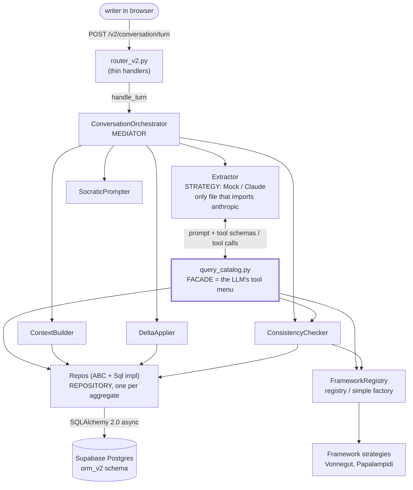
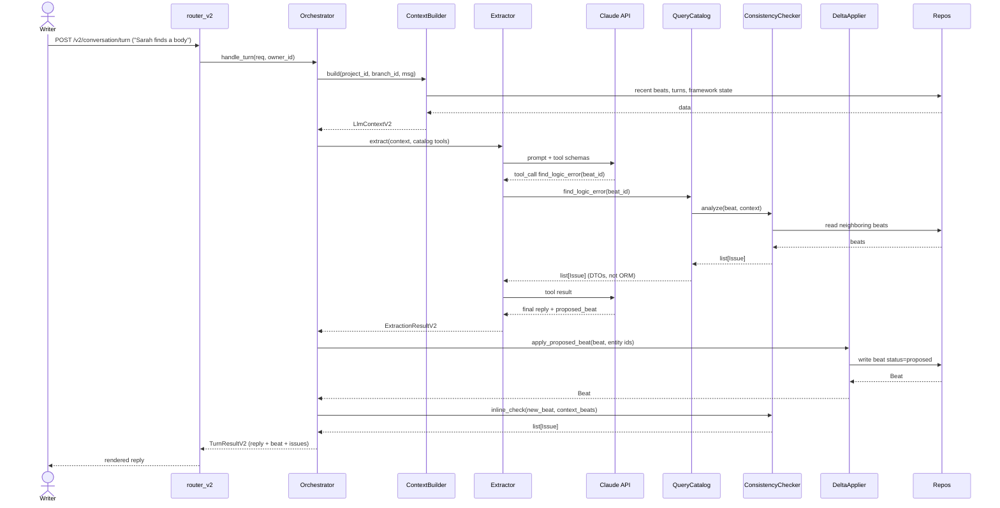
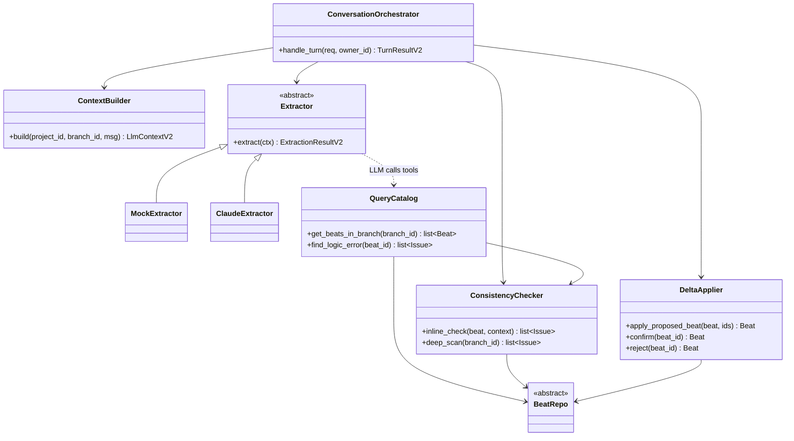
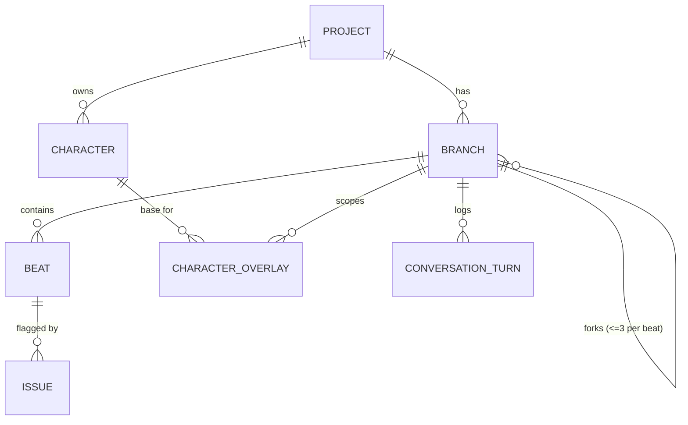
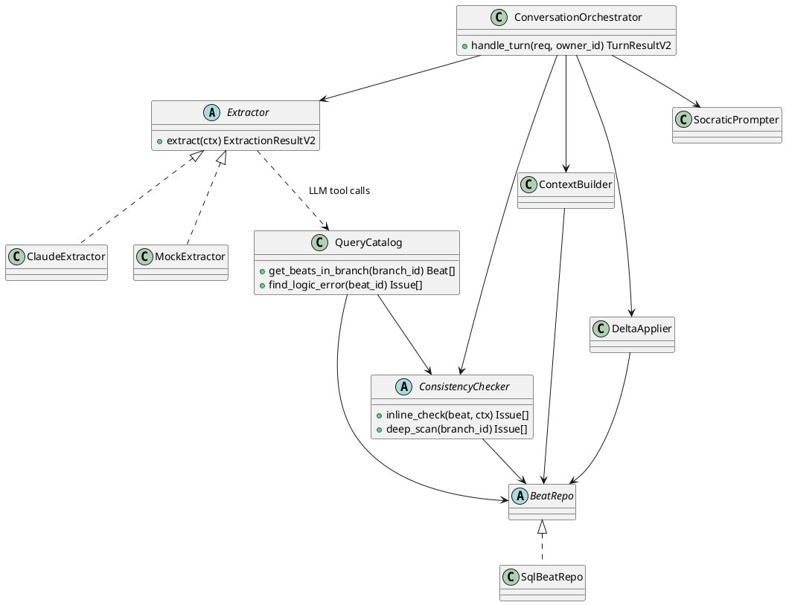
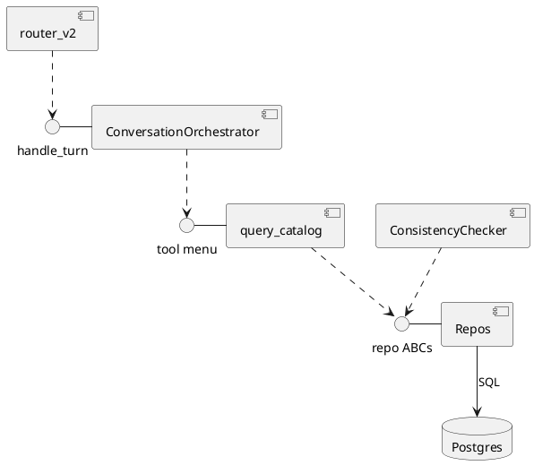

# Ampersand mid-layer architecture

How a writer's message becomes a stored, validated beat, and where every design
pattern sits. Read top to bottom once, then keep the diagrams handy while building
module 4 (query catalog) and module 5 (services + orchestrator).

## The one rule that explains everything

The LLM is sandboxed. It cannot see SQL, repos, or the database. It only does two things:

1. writes prose (the reply to the writer)
2. emits tool calls, structured `{name, args}` picked from a fixed menu

That menu is the **query catalog**. Everything below the catalog is invisible to the LLM.
Everything above the catalog (router, orchestrator) never builds SQL. Hold onto that and
the rest is plumbing.

## Layer map



The thick-bordered box (catalog) is the information-hiding boundary that matters most.
Cross it going down and you see repos and SQL; the LLM never crosses it.

> The rest of this doc is the CS 130 analysis: architectural style (L17), the four
> views (L17), the Parnas change-impact matrix (L5), GoF patterns (L6-L8), and formal
> UML (L2-L3). The matrix in the information-hiding section is the single best answer
> to "how is the LLM walled off," so if you read one new section, read that one.

## What each component owns

| Component | Job | Sees | Never sees |
|---|---|---|---|
| `router_v2.py` | HTTP in/out, one handler per endpoint, each <=10 lines | the orchestrator | repos, services, SQL |
| `ConversationOrchestrator` | owns the turn sequence, calls the services in order | all five services + catalog | SQL |
| `ContextBuilder` | gather state into `LlmContextV2` | repos | the LLM |
| `Extractor` | prose to structured beat, runs the Claude call | catalog, the anthropic SDK | repos directly |
| `query_catalog.py` | the LLM's tool menu, maps tool name to repo/service call | repos, checker, registry | nothing above it |
| `DeltaApplier` | atomically write proposed beat + entity links | repos | the LLM |
| `ConsistencyChecker` | find contradictions, inline and deep | repos, frameworks | the LLM (it is called, it does not call up) |
| `SocraticPrompter` | decide when to ask a clarifying question | the built context | repos |
| Repos | the only code that touches ORM and SQL | orm_v2, Postgres | the LLM, the router |

## Design patterns in play

GoF citations are Gamma/Helm/Johnson/Vlissides 1994. CS 130 lecture refs included where covered.

| Where | Pattern | GoF | CS 130 | Why it earns its place |
|---|---|---|---|---|
| `ConversationOrchestrator` | **Mediator** | pp. 273-282 | L6 | Five services would otherwise wire N-to-N. The orchestrator makes it N-to-1: services never call each other, only it calls them. Watch the god-object failure mode (see below). |
| `query_catalog.py` | **Facade** | pp. 185-193 | L8 | One simple surface (`get_beats_in_branch`, `find_logic_error`) hiding a messy subsystem (repos + frameworks + checker). Same role as `HomeTheaterFacade.watchMovie()` from lecture. |
| `Extractor` (Mock vs Claude) | **Strategy** | pp. 315-323 | L6 | Swap the mock for the real Claude call without touching the orchestrator. Same shape as Duck's FlyBehavior. |
| Framework strategies (Vonnegut, Papalampidi) | **Strategy** | pp. 315-323 | L6 | Each framework is an interchangeable algorithm for scoring a branch's arc. |
| Repos (`BranchRepo`, etc.) | **Repository** | not GoF (Fowler) | n/a | Collection-like access per aggregate root, hides persistence. Honest note for the writeup: this is Fowler, not one of the 23 GoF patterns. |
| `FrameworkRegistry.get("vonnegut")` | **Simple Factory** idiom | not GoF | L7 (mentioned) | Name to instance lookup. Not full Abstract Factory; do not over-build it. |
| `BranchStateMachine` | **State**-adjacent | pp. 305-313 | L8 / handout | Implemented as a transition table, not full State objects. That is the right call here; full State classes for a 4-state machine would be over-engineering. |
| each tool call as an object | **Command** | pp. 233-242 | L8 | OPTIONAL. Only worth it if you want to log/replay LLM actions. Your plan flags this as "interrogate." Default: skip it until you actually need replay. |

## One conversation turn, start to finish



Note the two separate uses of `ConsistencyChecker`: Claude pulls it on demand via the
catalog (`find_logic_error`), and the orchestrator runs it again as an inline check after
the write. Same component, two callers, written once. That is the answer to the plan's
"single shared service, not duplicated logic" question.

## Interfaces and types



## find_logic_error, traced (your exact question)

You asked whether `find_logic_error` should "itself be an LLM call." It can be, and the
crucial part is that nobody upstream can tell. The flow:

1. Claude (inside the Extractor) emits `find_logic_error(beat_id="abc")`.
2. The catalog receives that tool call and calls `ConsistencyChecker.analyze(...)`.
3. `ConsistencyChecker` is an ABC. Behind it you can put:
   - a **heuristic** impl (compare timeline fields, character facts, framework rules), or
   - an **LLM-backed** impl that pulls each beat's text and runs a validation prompt (your instinct), or
   - both, swapped via Strategy.
4. It returns `list[Issue]`, your Pydantic DTO.
5. The catalog hands those `Issue` objects back to Claude as a tool result.

The Extractor's Claude does not know a second model may have run inside the checker. The
catalog does not know either. They only know the `ConsistencyChecker` ABC and the `Issue`
type. That is information hiding doing its job: you can start with dumb heuristics, swap in
an LLM checker later, and not one line above the ABC changes.

Same `Issue` type renders in the UI, so there is one source of truth for "a problem in the
story," whether it surfaced from a tool call or the inline check.

## What is built vs not, and the build order

Built and on main:
- all repos (Project, Branch, Beat, Character, Theme, Setting, Issue, Conversation) on orm_v2
- `BranchStateMachine`
- `Extractor` ABC + `MockExtractor` (stub for ClaudeExtractor)
- the security module (sanitizer, validator, detector, manager)

Built and uncommitted on `feature/services-orchestrator` (stacked on `feature/post-merge-fixes`):
- `BeatEntities` DTO in `models_v2`
- `list_for_beat` on `CharacterRepo`, `ThemeRepo`, `SettingRepo` (with the boundary that each repo owns its own beat-entity link, project-id scoped for tenancy)
- `app/services/query_catalog.py`: the Facade with 10 retrieval tools, Pydantic-derived `tool_specs()`, validating `dispatch()`. Tenancy baked in at construction, never a tool argument.
- 6 new repo tests + 9 catalog tests. Full suite: 152 green.

Not built yet:
- `ConsistencyChecker` (unlocks the analytical tools `find_logic_error` and `scan_branch`)
- `frameworks/` module (Vonnegut + Papalampidi strategies + `FrameworkRegistry`, unlocks `classify_arc` and `framework_anomalies`)
- the analytical tools wired into the catalog (depends on the two above)
- the remaining module 5 services: `ContextBuilder`, `DeltaApplier`, `SocraticPrompter`, `ConversationOrchestrator`
- `router_v2.py` and the DI wiring (module 6)

Build order from here:
1. Commit and push the current branch as the catalog's retrieval wave.
2. `ConsistencyChecker` (ABC + a starting impl) and `frameworks/` (`Framework` ABC, the two concrete strategies, the registry) can be built in parallel.
3. Add the four analytical tools to `QueryCatalog` once 2 lands, completing the LLM tool surface.
4. `ContextBuilder`, `DeltaApplier`, `SocraticPrompter`.
5. `ConversationOrchestrator` last in module 5, it only wires the others.
6. `router_v2.py` + DI in module 6.

## The one failure mode to watch

The orchestrator is a Mediator, and GoF's own warning (p. 282) is that a Mediator
centralizes complexity and can rot into a god object. The line to hold: the orchestrator
**sequences** calls and passes results between services. The moment it starts computing arc
math, building SQL, or parsing LLM output itself, that logic belongs in a service instead.
Mediator coordinates; it does not do the work.

---

# CS 130 analysis

## Architectural style (L17)

Read in DOCUMENT mode (describing the system as designed, not a fresh recommendation).

**Style: Layered**, with the query catalog as a hard information-hiding boundary inside the
layering. Router talks only to the orchestrator, orchestrator only to services, services only
to repos, repos only to the DB. No layer reaches two layers down.

The plan optimizes two quality attributes above the rest:

- **Modifiability**: swap mock for Claude, heuristics for an LLM checker, InMemory for Postgres,
  each without touching callers. The plan states this outright as "maximum information hiding."
- **Testability**: every layer has a Mock or InMemory impl, so the orchestrator can be tested
  with no database and no API key.

Layered promotes modifiability, testability, understandability. It inhibits latency (a turn
hops router to orchestrator to service to repo to DB, several frames) and raw throughput. For
a single-writer creative tool that trade is correct; nobody needs sub-10ms here. You would only
feel the layering if you later batch-process thousands of beats at once.

## The four views (Clements et al., L17)

### View 1, Code Module (static packaging)

```
app/
  api/router_v2.py         (not built)   thin handlers
  services/
    orchestrator.py        (not built)   Mediator
    context_builder.py     (not built)
    extractor.py           (built)       ABC + MockExtractor; ClaudeExtractor stub
    delta_applier.py       (not built)
    consistency_checker.py (not built)
    socratic_prompter.py   (not built)
    query_catalog.py       (NOT BUILT)   the gap, the LLM tool surface
  frameworks/              (not built)   Strategy + registry
  repos/                   (built)       Repository, ABC + Sql impl
  domain/
    orm_v2.py              (built)       SQLAlchemy schema
    models_v2.py           (built)       Pydantic DTOs
```

Imports point down only. A repo never imports a service, a service never imports the router.
That single rule is what makes the layering real rather than aspirational.

### View 2, Data (orm_v2 spine)



The base + overlay split (CHARACTER plus CHARACTER_OVERLAY scoped by BRANCH) is the git-style
branching: one canonical character, per-branch deltas layered on read.

### View 3, Runtime Component and Connector

See the PlantUML component diagram under "Formal UML" below (ball-and-socket, the C&C notation).

### View 4, Behavioral

The sequence diagram near the top of this doc is the behavioral view of one turn.

## Information hiding: the change-impact matrix (Parnas 1972, L5)

The architecture is a bet on which decisions will change. Parnas's method: list the likely
changes first, then hide each one in a module so the change lands in a single place.

Anticipated changes:

- **C1**: swap `MockExtractor` for the real `ClaudeExtractor`
- **C2**: replace the heuristic consistency checker with an LLM-backed one
- **C3**: add a third narrative framework beside Vonnegut and Papalampidi
- **C4**: move repos from InMemory to Postgres
- **C5**: add or remove a tool the LLM can call
- **C6**: add a field to `Beat` (a schema change)

X means the change forces edits in that module:

| change | router | orchestrator | extractor | query_catalog | consistency_checker | framework_registry | repos | orm_v2 + models_v2 |
|---|---|---|---|---|---|---|---|---|
| C1 swap extractor impl | | | X | | | | | |
| C2 swap checker impl | | | | | X | | | |
| C3 add a framework | | | | | | X | | |
| C4 InMemory to Postgres | | | | | | | X | |
| C5 add/remove a tool | | | | X | | | | |
| C6 add a beat field | | | | | | | X | X |

Five of six changes touch exactly one column. That is a well-hidden design. C6 is honestly
wider because the DTO is the contract every beat-reader shares; data contracts are load-bearing
walls and are expected to ripple.

**This matrix is the literal answer to the panic.** "How does the LLM know its tools" is change
C5, and C5 touches only `query_catalog`. Add a tool there, the LLM sees the new schema next turn,
and the orchestrator, extractor, and repos do not change. There is no "LLM" column because no
code change to the LLM is even possible; it only ever reads the menu you expose.

Deep vs shallow (L5): the query catalog is a DEEP module, a tiny interface (a few tool names)
over a large subsystem (repos + frameworks + checker). Repos are deep (a few methods hiding all
the SQL). The module at risk of going shallow-and-wide is the orchestrator; keep its public
surface to `handle_turn` and push real work into the services, or it rots into the god object.

Single Choice Principle (L5): the list of frameworks lives in exactly one place,
`FrameworkRegistry`. C3 edits the registry and adds one class, nothing else. If a second place
ever enumerates frameworks, that is a leak, fix it.

## Formal UML, course notation (L2-L3)

GitHub renders the Mermaid diagrams above. For the writeup, here are the two core structures in
PlantUML with course-correct arrowheads (dashed hollow triangle = implements an ABC, plain arrow
= association, ball-and-socket = provided/required interface). Render at plantuml.com or a
PlantUML IDE plugin.

### Class diagram (Strategy + Facade + Mediator core)



The dashed hollow-triangle arrows (`<|..`) are realizations: `MockExtractor` and `ClaudeExtractor`
each implement the `Extractor` ABC, which is the Strategy seam. `SqlBeatRepo` realizes `BeatRepo`
the same way, which is the Repository seam.

### Component diagram, runtime C&C view (ball-and-socket)



Each socket (provided interface) is a place you can swap the implementation behind it without
touching the caller. That is the same modifiability claim as the change-impact matrix, drawn
instead of tabulated.
